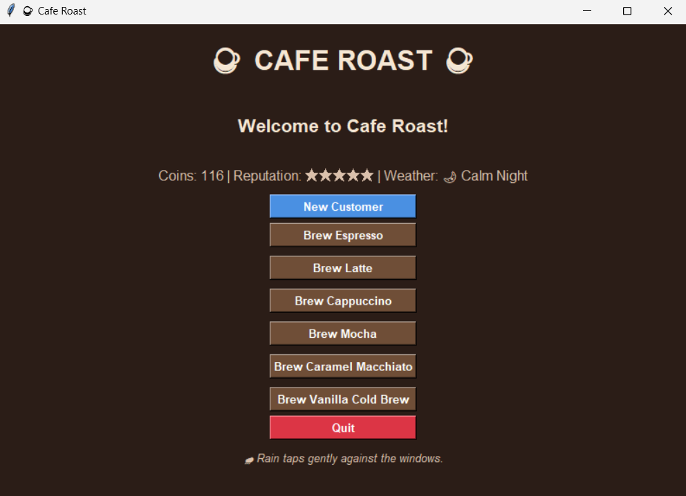
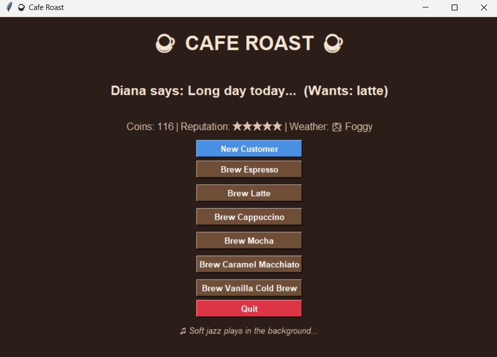
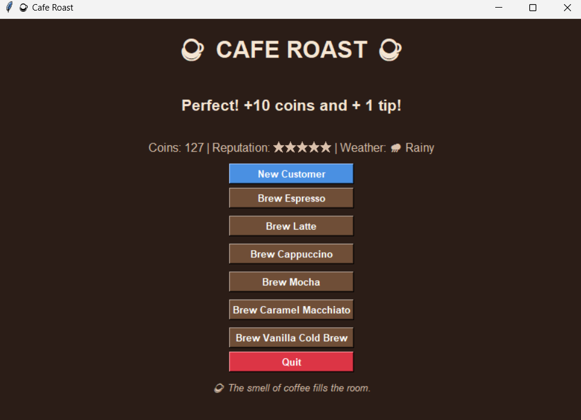
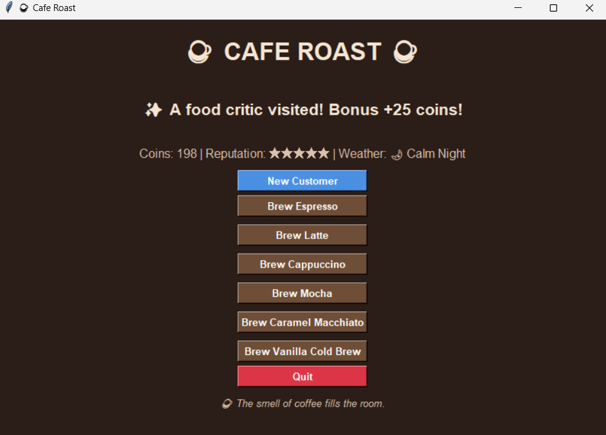

# ☕ Cafe Roast

A cozy café management game built with Python and Tkinter.

Serve drinks, earn coins, increase your reputation, and create the perfect relaxing café atmosphere.

## Features
- Dynamic customer system
- Random weather/events
- Persistent save system
- Atmospheric UI

## Tech Stack
- Python
- Tkinter
- JSON

## Future Features
- Customer queue system
- Café upgrades
- Sound effects
- Achievement system

## Screenshots

